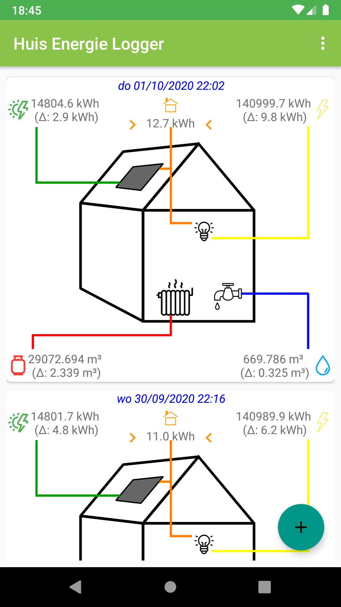
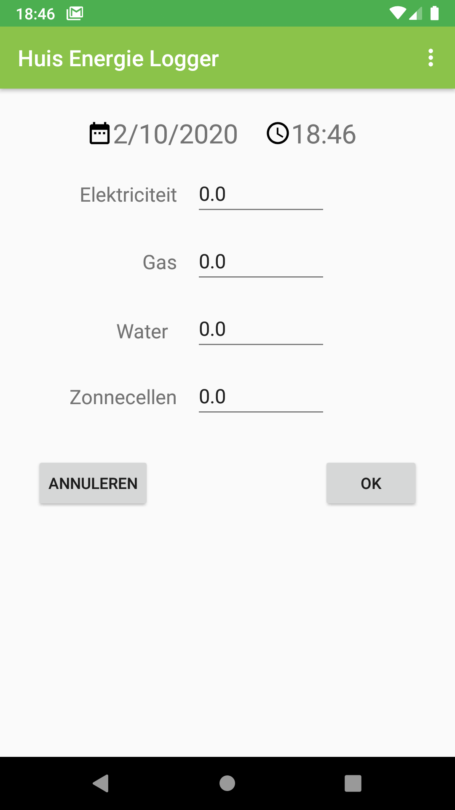
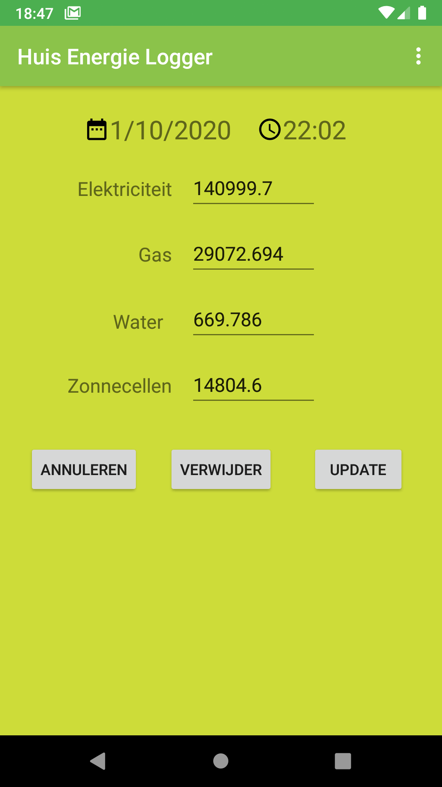
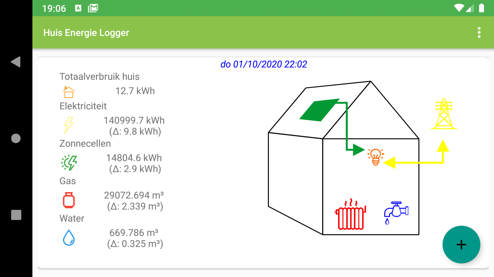
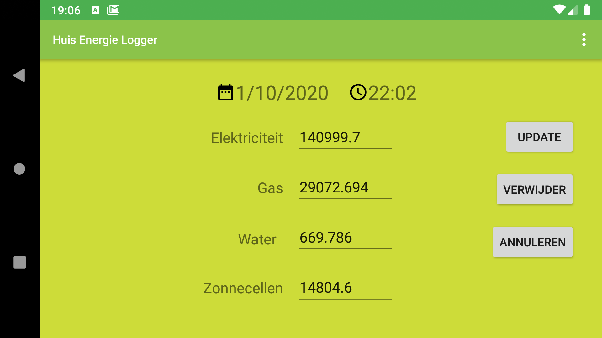

# Huis Energie Logger

Deze android app is bedoeld om dagelijks de meterstanden van water, gas, elektriciteit en zonnepanelen te registreren. Via de meterstanden wordt inzicht gegeven in een periodiek verbruik. Bv. wanneer dagelijks of wekelijks de meterstanden worden ingegevens, wordt daaruit het dag of weekverbruik berekend.

 
 
 
 
 
